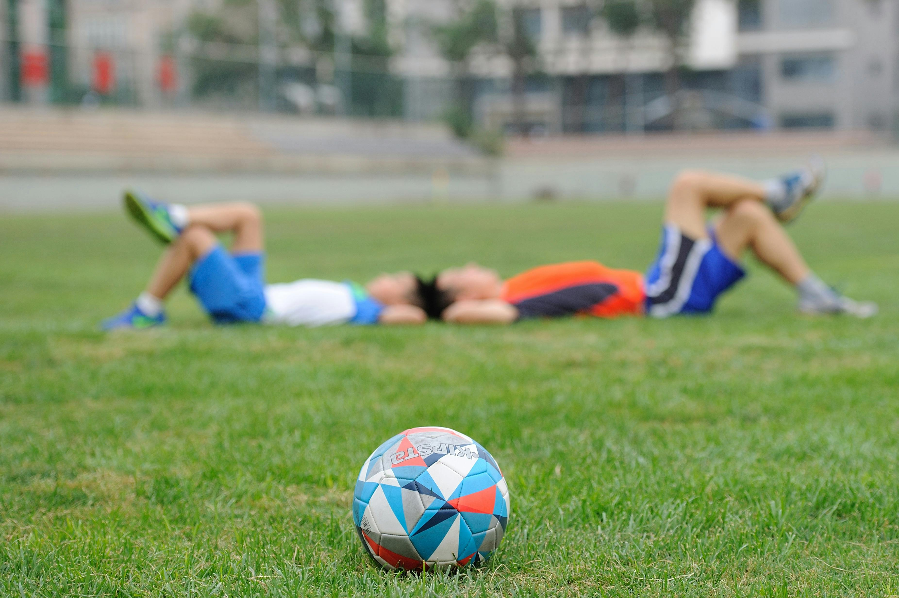

# ANPABAL

  

**ANPABAL** es una asociación deportiva ubicada en Vigo, Galicia, dedicada a fomentar el deporte y los valores en niños y niñas a través del fútbol sala. Nuestra principal misión es proporcionar un espacio seguro y divertido para que los más jóvenes puedan desarrollar sus habilidades y disfrutar del juego en equipo.

## ¿Quiénes somos?
Nacimos en 2001 como una extensión de las actividades extraescolares del CEIP Balaidos. Desde entonces, hemos crecido constantemente, ofreciendo programas de fútbol sala para todas las edades. 

## Actividades
* **Fútbol Sala:** Nuestra actividad principal. Ofrecemos entrenamientos adaptados a cada edad y nivel.
* **Escuelas Deportivas:** Programas diseñados para iniciarse en el fútbol sala de forma divertida y segura.
* **Competición:** Participamos en diferentes ligas y torneos a nivel local y autonómico.

## ¡Únete a nosotros!
Si a tu hijo/a le apasiona el fútbol sala, no dudes en contactarnos. Ofrecemos un ambiente familiar y profesional donde podrán aprender, divertirse y crecer.

**Más información:**
* **Web:** https://www.anpabal.es

**¡ANPABAL, más que un club, una familia!**
